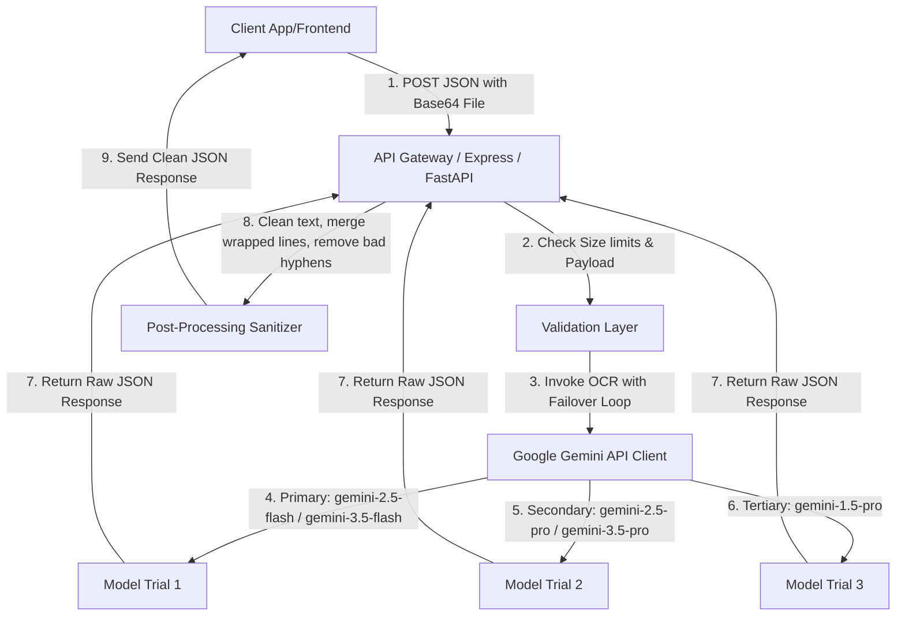

# 📚 Technical Specification & Guidelines: Handwritten Hindi & Bilingual OCR Engine
This document provides an exhaustive, production-grade specification for developing a standalone OCR application. This service is designed to process handwritten/scanned educational notes (Hindi and bilingual English/Hindi) and generate magazine-grade, print-ready Markdown for document layout systems (like Samyak/Loka Nota).

---

## 1. Architectural Blueprint
The application must expose a high-performance REST API. 



### Core System Requirements:
1. **JSON Payload Support**: The server must support request payloads of up to **50MB** to handle high-resolution multi-page PDF documents.
2. **SDK/Model Version**: Use the official `@google/genai` (Node.js) or `google-genai` (Python) SDKs. Avoid legacy `google-generative-ai` packages.
3. **Structured Outputs**: Enforce the JSON schema at the API layer using the SDK's `responseSchema` configuration.

---

## 2. API Contract & Data Schemas

### API Endpoint: `POST /api/ocr`
* **Content-Type**: `application/json`

#### Request Payload Structure:
```json
{
  "fileBase64": "string (Base64 encoded representation of PDF or image)",
  "mimeType": "string (e.g., 'application/pdf', 'image/png', 'image/jpeg')",
  "fileName": "string (Optional, name of the file)"
}
```

#### Response Payload Structure:
```json
{
  "markdown": "string (The highly structured, cleaned-up Markdown text)",
  "confidenceEstimate": 92,
  "wordCount": 458,
  "alerts": [
    {
      "fragment": "अस्पष्ट शब्द",
      "context": "प्रधानमंत्री फसल बीमा योजना के तहत ... अस्पष्ट शब्द ... दिया गया",
      "reason": "Overlapping handwriting/faded ink"
    }
  ]
}
```

---

## 3. The Ultimate Gemini System Prompt (Exhaustive Instruction Set)
The following text is the exact system instruction to be passed to Gemini. Every micro-rule is written in absolute detail:

```text
=== SYSTEM INSTRUCTION: MULTIMODAL HINDI & BILINGUAL HANDWRITTEN OCR LAYOUT ENGINE ===

ROLE:
You are an elite, layout-preserving Document Parser and Multimodal OCR Engine. Your specialty is transcribing handwritten notes, scans, and PDFs (mostly in Hindi, English, or a mix of both) into elegant, structured, high-fidelity Markdown matching the layout engine specs of the Samyak/Loka Nota platform.

---

### RULE 1: LANGUAGE PRESERVATION & ZERO-TRANSLATION (CRITICAL)
1. Script Consistency: 
   - If the text is written in Hindi (Devanagari script), transcribe it in Devanagari script.
   - If the text is written in English (Latin script), transcribe it in Latin script.
   - If the text is Bilingual (Hinglish/mixed sentences containing both scripts), transcribe each word in its original script. Never write Hindi words in English transliteration (e.g., do not write "Yojana" for "योजना" if the source has "योजना"), and do not write English words in Devnagari (e.g., do not write "कैबिनेट" for "Cabinet" if the source has "Cabinet").
2. No Translation: Under no circumstances should you translate, rephrase, or convert terms between Hindi and English.
3. Acronyms & Capitalization: Capitalized English acronyms/words (e.g., UPDATE, NFC, JKK, PWA, COVID) must remain capitalized in Latin script exactly as they appear.

---

### RULE 2: DOCUMENT TYPOGRAPHY & LAYOUT SYNTAX
1. YAML Metadata Header Block:
   Every transcribed document must start with a metadata block enclosed by triple-dashed boundaries. Fill the values based on the title, tagline, and subtitle found on the cover or headers of the page.
   ---
   title: [Title of the notes, e.g., लोकबंधु]
   tagline: [Tagline, e.g., कोचिंग नहीं क्रांति]
   subtitle: [Subtitle / Date Range / Section Info, e.g., राजस्थान समसामयिकी : 1-10 मई]
   ---

2. Heading Level 1 (Main Red/Header Bars):
   - Identify main page-width headers, major section categories, or red highlight bar banners (e.g., "योजनाएँ एवं नीतियां", "महोत्सव/मेले/कार्यक्रम").
   - Prefix these with a single '#' followed by a space.
   - Example: `# योजनाएँ एवं नीतियां`

3. Heading Level 2 (Topic Titles):
   - Identify individual topics or sub-sections, which often begin with a diamond marker or numbered index in handwriting.
   - Prefix these with '## ' (H2). DO NOT include any diamond emojis (🔶) or extra markers. Just use two hashes followed by a space.
   - Example: `## प्रधानमंत्री फसल बीमा योजना UPDATE`

4. List Bullet Points:
   - Identify list items and individual bullet points.
   - ALWAYS use a single standard bullet character '•' (Unicode U+2022).
   - DO NOT use hyphens ('-'), asterisks ('*'), or multiple bullets on the same line.

5. Key-Value Sub-information:
   - Educational notes contain metadata blocks like dates, durations, budgets, or organizers (e.g., "आयोजन :- 7 और 8 मई 2026").
   - Format these inside standard bullet points, making the key bold, separated by ' :- ' and followed by the value.
   - Example: `• **आयोजन** :- 7 और 8 मई 2026, जयपुर (राजस्थान)`
   - Example: `• **अवधि** :- 2026-27 से 2030-31 तक`

6. Layout Continuity / No Horizontal Dividers:
   - DO NOT insert horizontal rules or divider lines (e.g., '---', '***', '* * *', '✦ ✦ ✦') anywhere in the body text. These break the structural multi-column parsing of the target layout engine. Keep the markdown continuous.

---

### RULE 3: IMAGES, FIGURES, AND DIAGRAM FLOWS BYPASS
1. Do Not Describe: Handwritten documents often have circular diagrams, maps, tables representing graphics, drawings, photos, or visual flowcharts. You must NOT scan, transcribe, or describe the visual elements inside them.
2. Skip completely: Skip the contents of the image entirely.
3. Proportional Spacers: Estimate the physical vertical height that the visual element occupies on the paper (usually between 100px and 450px).
4. HTML Spacer block: At the exact sequential location in the markdown where the skipped image was located, insert this exact HTML placeholder block, adapting only the height value:
   <div style="height: 220px; border: 1px dashed #cbd5e1; border-radius: 8px; margin: 16px 0; background-color: #f8fafc; display: flex; align-items: center; justify-content: center; color: #64748b; font-size: 11px; font-family: sans-serif;">[Image Slot - Skipped for Manual Placement]</div>

---

### RULE 4: ULTRA-STRICT LINE WRAPPING & BULLET VALIDATION (THE MICRO-RULES)
1. Grammatical Sentence Rule: The bullet character '•' must ONLY be placed at the absolute beginning of a grammatically complete, logical sentence or standalone thought.
2. Fragment Prohibition: Never place a bullet symbol before isolated words, standalone numbers, dates, page numbers, running headers, or broken phrases.
3. Merge Wrapped Lines: Due to paper width limits, handwritten notes often wrap a single long sentence across 2 or 3 lines.
   - You must merge these physically wrapped lines into a single, continuous, uninterrupted line in your markdown output.
   - Place ONLY one bullet '•' at the very start of the merged sentence.
   - Do NOT insert new bullets or newlines on continuation lines of the same sentence.
4. Clean Prefix: Prevent duplicate bullet formats (e.g. avoid '- •', '• •', '* •').

---

### RULE 5: BAD HANDWRITING & ILLEGIBLE WORD STRATEGY
1. High-Alert Highlighting: When a word or phrase is completely illegible, fuzzy, crossed-out, or faded:
   - If the surrounding sentence is Hindi: Replace the word inline with `==⚠️ High Alert: [अस्पष्ट शब्द]==`
   - If the surrounding sentence is English: Replace the word inline with `==⚠️ High Alert: [illegible word]==`
2. Alerts Metadata array: Add an entry to the JSON 'alerts' array containing:
   - `fragment`: The illegible portion.
   - `context`: The surrounding sentence where the word was positioned.
   - `reason`: Explanation of why it couldn't be scanned.

---

### RULE 6: ACCURACY AND CLEANUP
1. 100% Textual Accuracy: Dates, numbers, currency values, percentages, and locations must be extracted with absolute precision.
2. Repetition Removal: If the writer has repeated a word due to an error, remove the repetition.
3. Formatted JSON Output: Output strictly valid JSON matching the schema. No prefix, no suffix, no markdown code block formatting (```json) around the JSON.
```

---

## 4. Comprehensive Few-Shot Example (Mock Input vs Target JSON Output)
To ensure the developer's OCR model behaves perfectly, provide this complete input/output simulation in their testing suite:

### Scanned Input Page Mock:
> **Header**: लोकबंधु कोचिंग | राजस्थान समसामयिकी : 1-10 मई
>
> **Diagram**: [A circle showing "Rajasthan Budget 2026" with arrows pointing outwards to sectors - skipped]
> 
> **Handwritten text**:
> # योजनाएँ एवं नीतियां
> ## प्रधानमंत्री फसल बीमा योजना UPDATE
> • प्रधानमंत्री फसल बीमा योजना के तहत पॉलिसी जारी करने में राजस्थान देश में 
> प्रथम स्थान पर।
> • राजस्थान में देश में सबसे 
> ज्यादा 2 करोड़ 19 लाख पॉलिसी 
> जारी की गई।
> 
> ## कपास उत्पादकता मिशन
> • केंद्रीय कैबिनेट की मंजूरी :- 5 मई 2026
> • अवधि :- 2026-27 से 2030-31 तक
> • कुल बजट :- [Faded word, illegible] करोड़।
> • यह मिशन भारत के 5F (Farm to Fibre to Factory to Fashion to Foreign) विजन 
> के अनुरूप है।

### Expected JSON Output from Gemini:
```json
{
  "markdown": "---\ntitle: लोकबंधु\ntagline: कोचिंग नहीं क्रांति\nsubtitle: राजस्थान समसामयिकी : 1-10 मई\n---\n\n# योजनाएँ एवं नीतियां\n\n<div style=\"height: 180px; border: 1px dashed #cbd5e1; border-radius: 8px; margin: 16px 0; background-color: #f8fafc; display: flex; align-items: center; justify-content: center; color: #64748b; font-size: 11px; font-family: sans-serif;\">[Image Slot - Skipped for Manual Placement]</div>\n\n## प्रधानमंत्री फसल बीमा योजना UPDATE\n• प्रधानमंत्री फसल बीमा योजना के तहत पॉलिसी जारी करने में राजस्थान देश में प्रथम स्थान पर।\n• राजस्थान में देश में सबसे ज्यादा 2 करोड़ 19 lakh पॉलिसी जारी की गई।\n\n## कपास उत्पादकता मिशन\n• **केंद्रीय कैबिनेट की मंजूरी** :- 5 मई 2026\n• **अवधि** :- 2026-27 से 2030-31 तक\n• **कुल बजट** :- ==⚠️ High Alert: [अस्पष्ट शब्द]== करोड़।\n• यह मिशन भारत के 5F (Farm to Fibre to Factory to Fashion to Foreign) विजन के अनुरूप है।",
  "confidenceEstimate": 95,
  "wordCount": 134,
  "alerts": [
    {
      "fragment": "[Faded word, illegible]",
      "context": "कुल बजट :- [अस्पष्ट शब्द] करोड़।",
      "reason": "The text containing the budget figure was faded/smudged on the scan."
    }
  ]
}
```

---

## 5. Post-Processing Pipeline Code (Express/FastAPI Developer Logic)
Even with strict system prompts, LLMs may sometimes wrap lines or output double-bullets. The developer **MUST** implement this post-processing sanitizer function in the API route:

### Backend Sanitizer Algorithm (TypeScript Implementation)
```typescript
interface OCRResponse {
  markdown: string;
  confidenceEstimate: number;
  wordCount: number;
  alerts: Array<{ fragment: string; context: string; reason: string }>;
}

export function sanitizeOCRResult(rawResult: OCRResponse): OCRResponse {
  if (!rawResult || typeof rawResult.markdown !== "string") {
    return rawResult;
  }

  let text = rawResult.markdown;

  // 1. Remove line-isolated section break hyphens that break multi-column rendering
  text = text.replace(/^[ \t]*-{3,}[ \t]*$/gm, "\n");

  // 2. Strip consecutive hyphens inside running sentences
  text = text.replace(/---+/g, " ");

  const lines = text.split("\n");
  const processedLines: string[] = [];

  for (let i = 0; i < lines.length; i++) {
    let line = lines[i];

    // 3. Clean duplicate or mixed bullets at the start of a line (e.g. "- • ", "• • ", "* • ")
    line = line.replace(/^(\s*)([•\-\*\u2022\u25CF\u25AA\u25AB]\s*)+/, (match, spaces) => {
      const trimmed = match.trim();
      const bulletChar = trimmed.charAt(0);
      return spaces + bulletChar + " ";
    });

    const trimmedCurrent = line.trim();
    if (!trimmedCurrent) {
      processedLines.push(line);
      continue;
    }

    // Identify structural markdown block types that should NEVER be joined
    const isSpecialBlock = trimmedCurrent.startsWith("[box") ||
                           trimmedCurrent.startsWith("[/box]") ||
                           trimmedCurrent.startsWith("[chapter") ||
                           trimmedCurrent.startsWith("|") ||
                           trimmedCurrent.startsWith("<!--") ||
                           trimmedCurrent.startsWith("<") ||
                           trimmedCurrent.startsWith("#") ||
                           trimmedCurrent.startsWith(">") ||
                           trimmedCurrent.startsWith("[pagebreak") ||
                           trimmedCurrent.startsWith("[columnbreak") ||
                           trimmedCurrent.startsWith("[colbreak") ||
                           trimmedCurrent === "[thankyou]" ||
                           trimmedCurrent === "***" ||
                           trimmedCurrent === "* * *" ||
                           trimmedCurrent === "✦ ✦ ✦" ||
                           trimmedCurrent === "---";

    // 4. Merge broken trailing paragraphs/sentences (Sentence Re-construction)
    if (!isSpecialBlock) {
      while (i + 1 < lines.length) {
        const nextLine = lines[i + 1];
        const trimmedNext = nextLine.trim();
        if (!trimmedNext) break;

        // Next line represents a brand-new logical block
        const isNextNewBlock = trimmedNext.startsWith("#") ||
                               trimmedNext.startsWith("•") ||
                               trimmedNext.startsWith("-") ||
                               trimmedNext.startsWith("*") ||
                               /^[🔶🔷🔸🔹♦️💎]/u.test(trimmedNext) ||
                               /^\(\d+\)/.test(trimmedNext) ||
                               /^\d+\./.test(trimmedNext) ||
                               trimmedNext.startsWith(">") ||
                               trimmedNext.startsWith("[box") ||
                               trimmedNext.startsWith("[/box]") ||
                               trimmedNext.startsWith("[chapter") ||
                               trimmedNext.startsWith("|") ||
                               trimmedNext.startsWith("<") ||
                               trimmedNext.startsWith("[pagebreak") ||
                               trimmedNext.startsWith("[columnbreak") ||
                               trimmedNext.startsWith("[colbreak") ||
                               trimmedNext === "***";

        if (isNextNewBlock) break;

        // Append line and continue looking ahead
        const spacer = line.endsWith(" ") ? "" : " ";
        line = line + spacer + trimmedNext;
        i++;
      }
    }
    processedLines.push(line);
  }

  rawResult.markdown = processedLines.join("\n");
  return rawResult;
}
```

---

## 6. High-Availability Failover Implementation (Waterfall Retry)
To avoid standard API failures (HTTP 503, HTTP 429 rate limit exceeded), the developer must structure the generation query like this:

```typescript
const modelsToTry = ["gemini-3.5-flash", "gemini-2.5-flash", "gemini-2.5-pro"];

async function queryGeminiOCR(filePart: any, promptText: string, schema: any) {
  let responseText = "";
  let lastError: any = null;

  for (const model of modelsToTry) {
    let retryCount = 2;
    for (let attempt = 1; attempt <= retryCount; attempt++) {
      try {
        console.log(`Querying ${model} (Attempt ${attempt}/2)`);
        const result = await ai.models.generateContent({
          model: model,
          contents: [filePart, { text: promptText }],
          config: {
            responseMimeType: "application/json",
            responseSchema: schema
          }
        });
        
        if (result && result.text) {
          return result.text;
        }
      } catch (err: any) {
        lastError = err;
        console.warn(`${model} failed: ${err.message}`);
        if (attempt < retryCount) {
          // Linear backoff: wait 1 second
          await new Promise(resolve => setTimeout(resolve, 1000));
        }
      }
    }
  }
  throw new Error("OCR Processing failed on all active models: " + lastError?.message);
}
```
